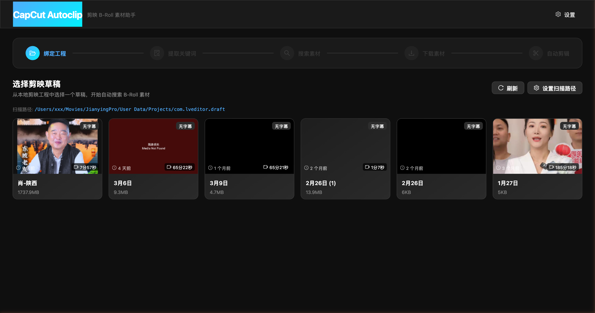
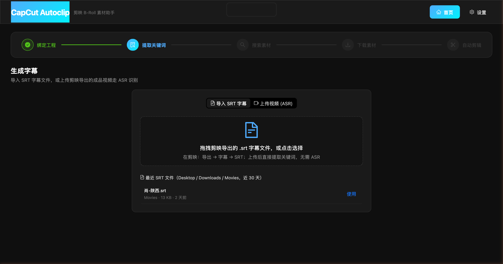
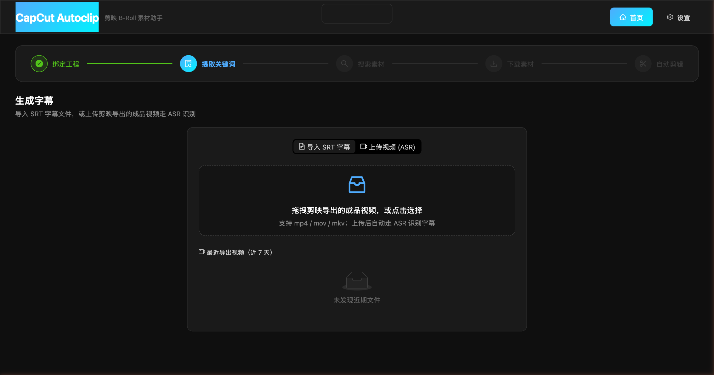
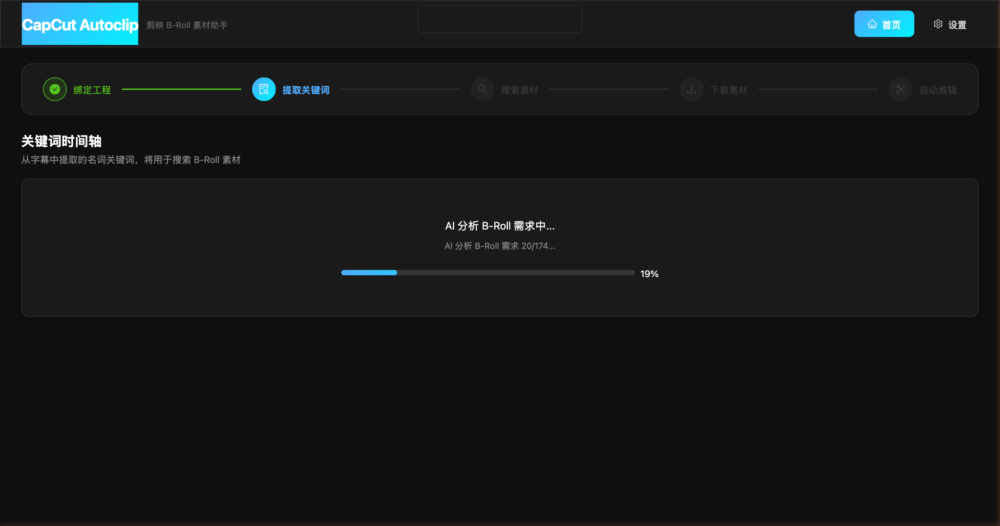
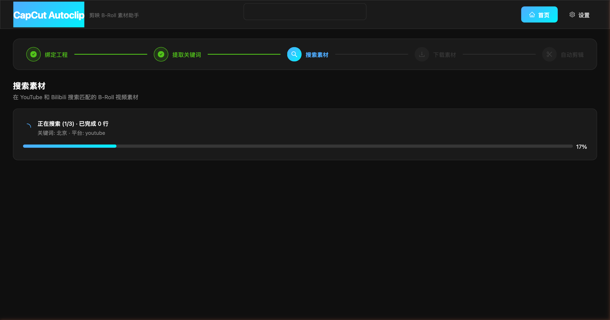
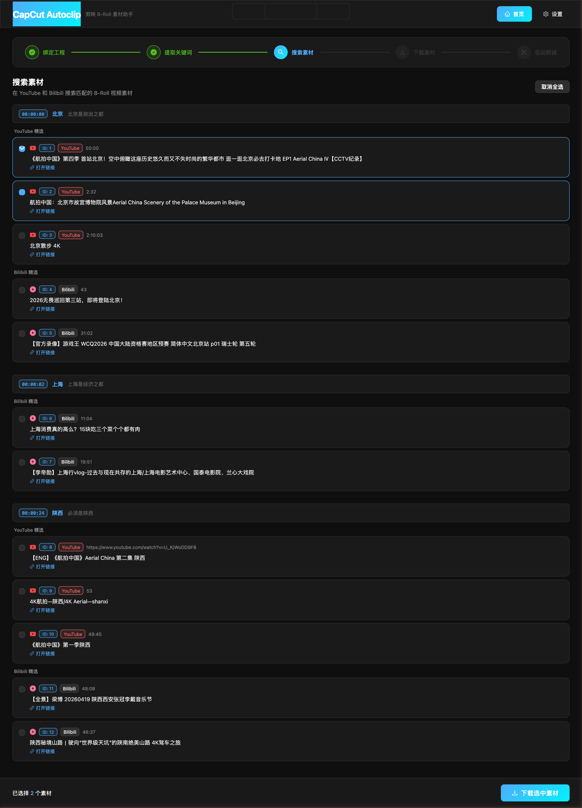
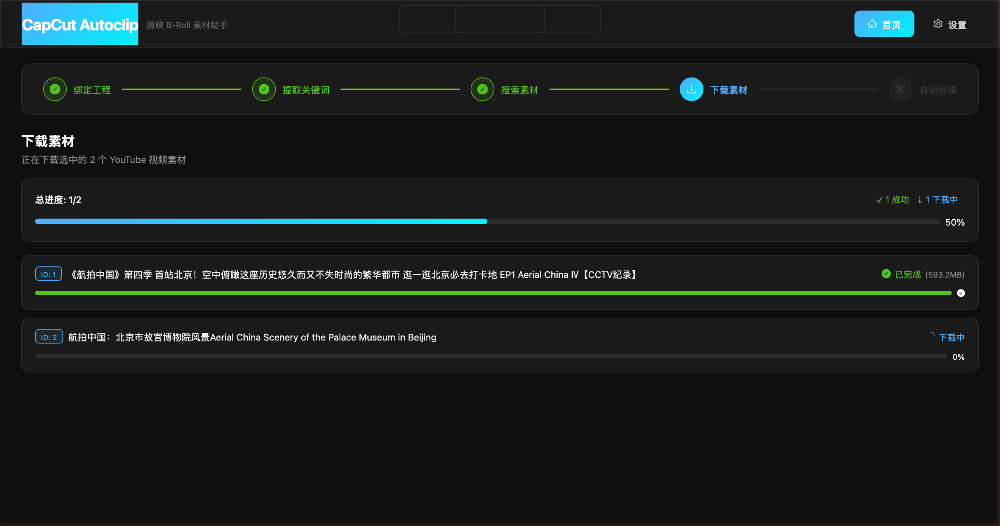

# CapCut Autoclip 小白使用教程

> 读完这一篇，你能把「一段剪映草稿」→「自动补齐 B-Roll 素材」全流程跑通。
> 全程 5 步，大多数时候你只需要点几下鼠标。

---

## 一、它能做什么？

想象你在剪一段讲历史、讲地理、讲人物的视频，字幕里提到**北京、上海、陕西、农民、陶罐**这些词，每次都要手动去搜"陕西航拍 4K"再一个个下载。

**CapCut Autoclip 把这个过程自动化了：**

1. 读取你的剪映草稿字幕
2. 用 AI 挑出"需要配 B-Roll 的句子"
3. 自动在 YouTube + Bilibili 搜配套素材
4. 一键批量下载

最后你只要回到剪映，把下载好的素材拖到时间轴上。

---

## 二、第一次打开：安装与启动

### 2.1 检查前置依赖

打开 Mac 的 **终端**（在"启动台"搜索 Terminal），复制粘贴下面这行然后回车：

```bash
git --version && python3 --version && node --version && ffmpeg -version 2>/dev/null | head -1 && yt-dlp --version
```

- 如果每行都输出版本号（例如 `git version 2.x`、`Python 3.13`）就没问题。
- 哪一行报 `command not found` 就补装哪个。最快的方式是用 Homebrew：

```bash
# 如果没装 Homebrew 先装它：
/bin/bash -c "$(curl -fsSL https://raw.githubusercontent.com/Homebrew/install/HEAD/install.sh)"

# 然后缺啥补啥：
brew install git python@3.13 node ffmpeg yt-dlp
```

> 💡 `ffmpeg` 是给 ASR（语音识别字幕）用的，`yt-dlp` 是下载 YouTube / Bilibili 视频的，两个都强烈建议装。

### 2.2 一键安装

终端粘贴这一行：

```bash
curl -fsSL https://raw.githubusercontent.com/yanlinyi101/capcut-autoclip/main/install.sh | bash
```

脚本会自动做四件事：

1. 把代码克隆到你的目录
2. 创建 Python 虚拟环境
3. 装所有依赖（需要 2–5 分钟）
4. 问你要不要立即启动

选 **y** 启动后，浏览器会自动打开 `http://localhost:3002`。

### 2.3 下次启动

第一次装好后，以后想用，只要在项目目录下跑：

```bash
cd ~/capcut-autoclip     # 或者你当初克隆到的位置
./start.sh
```

浏览器会自己跳出来。

> 💡 **关掉服务**：终端里按 `Ctrl + C` 两次。

---

## 三、必做设置（设置页逐项讲解）

点右上角 ⚙️ **设置** 进入设置页。


### 3.1 剪映草稿扫描

- **剪映草稿目录**：工具要去哪里找你的剪映工程。
  - 默认值：`~/Movies/JianyingPro/User Data/Projects/com.lveditor.draft`
  - 一般不用改。如果你把剪映装在别的位置，把真实路径粘贴进去即可。

### 3.2 搜索与下载

| 字段 | 填啥 | 小白建议 |
|---|---|---|
| **yt-dlp 路径** | 默认 `yt-dlp` 就行 | 不动 |
| **代理地址** | YouTube 在国内要走代理才能访问。填你代理软件的地址，例如 `http://127.0.0.1:7890` | 不翻墙的话先留空，只用 Bilibili |
| **每次搜索处理行数** | 一次最多同时搜几行字幕 | 默认 100 即可 |
| **每平台结果数** | 每个关键词每个平台要返回几个候选 | 默认 3 最舒服，多了选起来累 |
| **下载格式** | yt-dlp 的格式字符串 | 默认 `bestvideo*+bestaudio/best`，不懂就不动 |

### 3.3 语音识别（ASR）

当你的剪映草稿里没有字幕文件时，工具会从视频里识别字幕。

- **ASR 方式**：
  - `bcut-asr`（**推荐**）：用 B 站的免费在线识别，要联网，快
  - `whisper`：用 OpenAI Whisper，本地跑，慢但不联网
- **Whisper 模型**：选 whisper 时才用，小白选 `base` 即可
- **语言**：中文视频填 `zh`，英文填 `en`，不确定填 `auto`
- **ffmpeg 路径**：默认 `ffmpeg` 就行

### 3.4 AI 分析

这一块决定了工具能不能"聪明地"挑出哪些句子该配 B-Roll。

- **启用 AI 分析 B-Roll 需求**：**建议打开**。关闭后会退回规则判断，准确度明显下降。
- **API Key**：去 [DeepSeek 平台](https://platform.deepseek.com/) 注册，充值几元钱拿一个 `sk-...` 开头的 Key 填进来。整部视频分析费用通常不到 0.5 元。
- **Base URL**：默认 `https://api.deepseek.com`，不动。
- **模型**：`deepseek-chat` 够用、便宜。`deepseek-reasoner` 更准但更慢更贵。

### 3.5 保存

所有改完后，**记得拉到最下面点蓝色的「保存设置」按钮**，否则不生效。

> ⚠️ 第一次用如果不填 DeepSeek Key，B-Roll 判断会走规则降级，效果差不少。强烈推荐先把 Key 配好再进 5 步流程。

---

## 四、5 步流程走一遍

### Step 1 · 选择草稿（首页）

打开 `http://localhost:3002`，你会看到本机所有剪映草稿：



**每张卡片告诉你**：
- **左上**：字幕状态（`有字幕` / `可生成` / `无字幕`）
- **右上角 ⏱**：视频总时长
- **左下**：最近修改时间
- **下方**：草稿名 + 素材大小

**操作**：点一张卡片即可。工具会把这个草稿"绑定"到当前流程，顶部绿色小标签显示 `已绑定：XXX`。

> 💡 **看不到草稿**？两种可能：
> - 剪映没打开过 → 先在剪映里新建一个空工程保存一下
> - 路径不对 → 回到设置页改「剪映草稿目录」

---

### Step 2 · 提供字幕

绑定草稿后会自动跳到"提取关键词"页。接下来分两种情况：

#### 情况 A：草稿里已经有字幕 / 你手上有 SRT 文件



- **拖拽上传**：把 `.srt` 文件直接拖到虚线框里
- **最近文件**：下面列出 Desktop / Downloads / Movies 近 30 天的 SRT，点「使用」就行
- **从剪映导出 SRT**：剪映里 `导出 → 字幕 → SRT`

#### 情况 B：只有成品视频，没字幕

点顶部 **「上传视频 (ASR)」** 标签页：



- 拖一个 `.mp4 / .mov / .mkv` 进虚线框
- 上传后工具会自动：**提取音频 → 语音识别 → 生成 SRT**
- 识别大约按视频时长 1:3（5 分钟视频约 1.5 分钟出字幕）

---

### Step 3 · AI 关键词分析

字幕就位后，工具会自动做两件事：

1. 用 **jieba** 从字幕里抽名词关键词（地名、人名、物品）
2. 用 **DeepSeek** 判断每一行"是否值得配画面"



等进度条跑完，你会看到一张**关键词时间轴表**：


**表格怎么看**：

| 列 | 说明 |
|---|---|
| **#** | 行号 |
| **开始 / 结束** | SRT 时间轴 |
| **字幕文本** | 原句 |
| **关键词** | 自动抽出的名词，可以 × 删、也可以 `+ 新增` 手动加 |
| **B-Roll** | 勾上表示"这句要搜素材"，右边 tooltip 显示 AI 的理由（如"提到具体地点北京"） |

**顶部批量按钮**：
- **全 选** / **取消全选**
- **只选 AI 推荐**：最常用，一键只勾 AI 觉得需要补画面的行

右上还能勾 **YouTube** / **Bilibili** 选搜索来源。

准备好点蓝色 **「开始搜索 (已选 N 行)」** 进入下一步。

> 💡 一开始别贪多，先 `只选 AI 推荐` 或手动勾 3–5 行跑通流程，熟了再批量。

---

### Step 4 · 搜索素材

工具会对每一个勾选的关键词，在 YouTube 和 Bilibili 分别搜一遍，**实时推送进度**：



搜完后每个关键词下会展开候选卡片（每平台按你在设置里填的"每平台结果数"显示）：


**每张卡片**：
- 左上是平台图标（红色 YouTube / 品红 Bilibili）
- 标题下的 **「打开链接」** 可以直接点进去预览
- 左边的复选框就是"要不要下载"

**操作**：浏览一下标题，勾想要的。选了之后底部会出现悬浮栏：



点蓝色 **「下载选中素材」** 开始下载。

> 💡 YouTube 里标题带「讲解 / 解说 / reaction」的已经被过滤。Bilibili 里多 P 合集会自动去重。

> 💡 下载前点一下「打开链接」预览画面是个好习惯——搜索匹配不完美，偶尔会有不相关的结果。

---

### Step 5 · 批量下载

这一步你什么都不用干，看进度即可。



**顶部总进度**：成功 / 失败 / 进行中 / 等待中 的计数

**下方每一条**：显示单个素材的下载进度，成功打勾、失败红叉

全部完成后，顶部会出现 **「下一步：自动剪辑」** 按钮（本教程聚焦下载流程，剪辑环节就不展开了）。

---

## 五、文件去了哪里？

下载好的素材统一放在这里：

```
{你的剪映草稿目录}/autoclip_downloads/
```

比如你绑定的草稿叫 `肖-陕西`，就会在：

```
~/Movies/JianyingPro/User Data/Projects/com.lveditor.draft/肖-陕西/autoclip_downloads/
```

**回到剪映用**：

1. 剪映里打开刚才那个草稿
2. 素材面板 → 导入 → 选到 `autoclip_downloads/` 文件夹
3. 全选所有视频 → 拖到时间轴

---

## 六、常见问题

### ❓ 首页看不到草稿

- 剪映至少打开并保存过一个工程
- 设置页的「剪映草稿目录」路径对不对？Finder 里去这个路径确认一下有没有子文件夹

### ❓ ASR 一直卡在"提取音频"

- 先检查终端运行 `ffmpeg -version`，没装就 `brew install ffmpeg`
- 视频太大（>1GB）也会很慢，耐心等

### ❓ YouTube 全部下载失败

- 没代理：设置页填代理地址（例如 `http://127.0.0.1:7890`）
- 代理填错：先在浏览器访问 youtube.com 确认能打开
- yt-dlp 太老：终端跑 `brew upgrade yt-dlp` 或 `pip install -U yt-dlp`

### ❓ AI 分析不启动 / 用的是规则判断

- 设置页「启用 AI 分析 B-Roll 需求」开关打开了吗？
- DeepSeek Key 填对了吗？Key 应以 `sk-` 开头
- 账户里有余额吗？去 [platform.deepseek.com](https://platform.deepseek.com) 看

### ❓ 想换 DeepSeek 之外的模型

- 设置页「模型」下拉框还支持 `gpt-4o` / `gpt-4o-mini`
- 换模型时记得把 Base URL 改成对应服务商的 API 地址

---

## 七、一页速查

```
1. 打开终端 → cd ~/capcut-autoclip → ./start.sh
2. 浏览器自动打开 localhost:3002
3. 点一张草稿 → 拖 SRT 或上传视频走 ASR
4. 等 AI 分析 → 点「只选 AI 推荐」→ 开始搜索
5. 勾想要的素材 → 下载选中素材 → 完成
6. 剪映导入 autoclip_downloads/ 文件夹
```

搞定，祝剪辑愉快。
